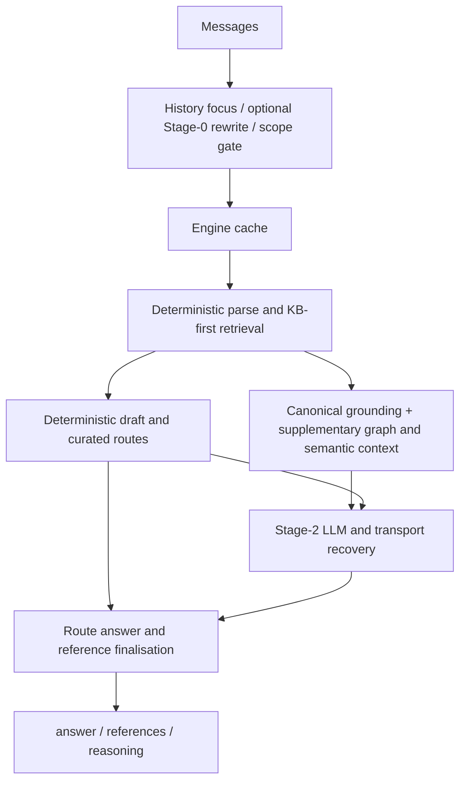
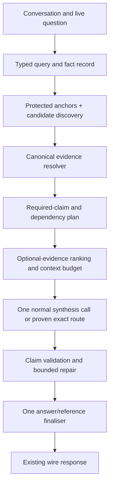

# Regenold EU AI Act RAG: architecture review and performance proposal

**Reviewed:** 13 September 2026  
**Local branch:** `fix/r409-r408-audit`  
**Committed baseline:** `a4769372e6b93f1754c3f3f234ab3a5e8d14fb08`  
**Scope:** current local working tree, reachable application paths, evaluation implementation, recorded experiments, and selected primary research through the review date.

## Recommendation

Evolve the existing service into a **claim-centred, source-grounded hybrid pipeline**. Keep the proven deterministic routes and KB-first retrieval. Use the ontology and taxonomy to interpret the question, the graph to find statutory structure and dependencies, semantic retrieval to locate relevant passages, and the reranker to order optional evidence. Give the LLM a compact answer plan with explicit supporting passages and protected legal conditions. Produce the final answer and references from the same accepted claim records.

The most valuable change is the contract between these components. Today, several layers independently add context, alter prose, and reconstruct references. Correct information can be retrieved, omitted during prompt construction, shortened incorrectly during generation, or disconnected from its citation during finalisation. Increasing retrieval depth alone does not address those losses.

The proposed architecture is **SOTA-informed, not a demonstrated SOTA result**. No new live pairwise quality evaluation was run for this report, and no universal best model or score improvement can be established from a code review. Its priorities reflect this repository's evidence, including negative results, rather than assuming that a newer RAG component will improve the competition score.

The first implementation should be a narrow trial of a claim contract on well-defined statutory lists and scoped obligations, preceded by transport/provenance fixes. Broad graph expansion, automatic citation pruning, unconditional prompt changes, and a general-purpose agent loop should remain outside that first trial.

## 1. What was checked

I inspected the route, engine, graph-context renderer, semantic graph retrieval, KB search, ontology, taxonomy definitions, legal AST, reranker, generation/transport seams, and evaluation code. I traced call sites rather than inferring execution from module names or architecture comments. I also read the R411 architecture audit, R416 corrections and checkpoint, and the R403 measurement record.

The working tree already contained changes to five application files: the engine, its context model, LogicRAG, the Bedrock client, and the route. These include R417/R418 transport provenance, retry, history, and scoping work. They are part of this review but **are not part of the committed baseline**. Three related test files were untracked. I did not fetch a remote branch, verify the currently deployed revision, query live Aura, or change application code, configuration defaults, schemas, or seed versions.

Source hashes, line counts, and two executable probes are in the accompanying [audit evidence](<D:/Claude Projects/regenold-eu-ai-act-rag/docs/reviews/2026-09-13-hybrid-rag-audit-evidence.json>). The hashes identify the actual files reviewed; a commit ID alone would omit the working-tree changes.

### Verification performed

| Check | Result | Interpretation |
|---|---|---|
| Eight focused files covering cache identity, route contracts, modality, provenance, and R417/R418 changes | 74 passed, 2 failed | The current working tree is not fully green on these checks. |
| Five focused files covering tracked imports, semantic wiring, rerank request budgets, ontology search, and semantic extraction | 67 passed | These local contracts passed. |
| Isolated rerun of `test_r418_review_fixes.py` | 11 passed, the same 2 failed | The failures also occur in file-scoped execution. |
| AST alias and scoring-definition probes | Reproduced; values saved in the evidence JSON | These findings are independently executable, not historical assertions. |

Across the two non-overlapping test batches: **141 passed, 2 failed**. The isolated rerun is not additional coverage.

The failing tests are the two denoiser-to-wrapper fallback counter tests at lines 187–200 of [test_r418_review_fixes.py](<D:/Claude Projects/regenold-eu-ai-act-rag/tests/test_r418_review_fixes.py:187>). The isolated run returns the mocked access-denied result instead of reaching the wrapper. The fixture patches `wrapper_fallback_enabled` but leaves the separate `is_openai_wrapper_enabled` check in the fallback path active; that is an evident environmental dependency under the prescribed `provider=cli` setup. The combined run additionally encountered a real provider object and a credentials lookup blocked by the suite's network guard. Review fixture/singleton isolation before attributing these failures to production behaviour. Do not weaken the assertions or treat the new counter fix as verified by these failing tests.

The system `python` executable failed to initialise its standard library. Tests ran successfully with the repository's `.venv/Scripts/python.exe`. No full-suite, clean-clone boot, or live merge-gate result is claimed.

## 2. Architecture as implemented

The central route is **12,311 lines / 142 top-level functions**, and the main engine is **12,655 lines / 157 top-level functions** in this snapshot. Size is a maintenance signal; the functional issue is that orchestration, specialised answers, evidence construction, transport recovery, and citation ownership are intertwined.



This is a high-level execution map, not a claim that every request uses every branch. Curated and selected definitional paths can skip Stage-2. Optional rewrite, graph reads, learned reranking, and provider availability have their own gates.

### Component responsibilities and current limits

| Component | What the current code actually does | Architectural implication |
|---|---|---|
| Query interpretation | The route separates the live question, history and system context, with optional LLM denoising and re-ask focus. The engine parses deterministically. | Keep retrieval intent distinct from the full conversation needed for answering. |
| KB and lexical retrieval | `_deterministic_parse` extracts anchors and uses keyword/KB retrieval. BM25 is an important fallback, including ontology-derived virtual documents. `_retrieve_from_graph` normally selects KB-primary retrieval. | This is already a specialised hybrid system. Replacing it with indiscriminate vector search would discard useful precision. |
| Typed ontology | `app/data/ontology.py` represents actors, risks, practices, phases, Annex III categories, and role-duty mappings; these support search and deterministic answers. | Preserve these mappings, but attach each legal assertion to canonical statutory evidence. |
| Taxonomy | Statutory categories and the separate agentic compound-risk taxonomy represent different kinds of knowledge. Graph schema/ingestion support does not establish that every taxonomy relation influences `/ask`. | Advisory agentic-risk categories must not become statutory classifications by association. Measure actual use at the consumer. |
| Knowledge graph | The normal design is additive: hierarchy, points/subpoints, cross-references, recital anchors and supplementary context. | Use it to restore structure and find dependencies, while canonical text remains the citation authority. |
| Semantic layer | `semantic_layer.py` contains tree paragraph extraction, cross-reference context and an AST adapter. `graph_semantic.py` performs ANN passage selection within selected provision heads; definition/recital gloss is separately gated. | “Semantic layer” is not a single reasoning engine. Separate retrieval, interpretation and normative evaluation contracts. |
| Dense retrieval | There are multiple paths, including local TF-IDF/SVD sentence embeddings and Neo4j vector indexes. Broad graph-vector recall is gated separately from constrained semantic context. | Identify embedding/index versions and measure each path's marginal contribution. A local SVD representation is not interchangeable with a modern pretrained semantic embedder. |
| Reranker | Cohere reranking defaults ON when a key exists. Its important wired placement reorders `_kg_refs` before graph-context rendering. The permutation contract preserves candidates. | It can still change which evidence survives a later context budget, and consequently change prose and wire references. |
| Deterministic generation | Curated intercepts, statutory lists, role/risk answers and scenario handlers supply a strong domain-specific floor. | Retain proven exact routes. Their existence does not establish that every deterministic draft is legally complete. |
| LLM generation | Stage-2 uses deterministic material and supplementary evidence, with modality-dependent prompt handling and transport fallbacks. | Treat it as a substantive answer-producing stage, not cosmetic polishing. |
| Reference finalisation | The route reconciles references with prose, adds named references, surfaces subpoints, collapses parents and deepens grain, among other passes. | The final citation set has multiple owners. This is the central coupling to simplify. |

Cohere is a learned remote relevance model, and Stage-0/Stage-2 are LLM operations. It is useful to distinguish reproducible retrieval/rules from probabilistic interpretation rather than describing everything before final generation as “deterministic.”

### Findings that materially change the recommendation

**A. Retrieval success is not evidence sufficiency.** The earlier R411 triage reported that 49 of 51 engine-gap criteria already had the relevant provision in emitted references. This identifies a promising area for investigation, but does not prove that retrieval was sufficient: an article head may be present while the necessary paragraph, exception, or governing clause never reached the model. Measure five separate boundaries: candidate discovery, exact evidence availability, prompt inclusion, answer preservation, and final citation attachment.

**B. Prompt-only changes can change references.** The route's live prose-to-reference passes establish this directly. A non-citable graph block is not reference-neutral. Claims in older module comments that supplementary context cannot change citation metrics are too broad. Preserve the distinction between “cannot directly emit a citation” and “cannot influence the final citation set.” See the [supplementary-context call site](<D:/Claude Projects/regenold-eu-ai-act-rag/app/engines/_graph_rag_impl.py:8837>) and [live reconciliation](<D:/Claude Projects/regenold-eu-ai-act-rag/app/routes/regenold.py:11177>).

**C. Single-turn improvements do not transfer automatically to pushbacks.** Current code scopes the KG point-text lever by conversation depth. The R416 checkpoint records a 32-pair hard-mode reading with `gold_dropped_head` increasing 12 → 14 when point text was enabled unconditionally. The full-system prompt also has a single-turn restriction. Do not describe either as globally safe. The earlier claim that the Article 14 aim-clause recovery proved the point-text mechanism was subsequently retracted: transport fallback and cached generations confounded that explanation. [R416 checkpoint](<D:/Claude Projects/regenold-eu-ai-act-rag/docs/measurements/r416/CHECKPOINT.md>)

**D. Graph expansion is often budget-inert.** KB search records 660 available hop-two references but only four additions over 132 rows because BM25 had already filled the budget. Increasing slack is not automatically valuable: first determine whether the graph supplies missing *required evidence*, then whether it improves a live answer without adding irrelevant duties. [Fusion boundary](<D:/Claude Projects/regenold-eu-ai-act-rag/app/data/kb_search.py:957>)

**E. The legal AST is not a production-complete legal reasoner.** `parse_article_to_ast` explicitly contains a stub. Its substring test matches `Art. 50` and `Art. 53` as well as `Art. 5`, while `Article 5` does not match. The saved probe returns `True` for all three short forms when only `vulnerability=True` is supplied. The model omits statutory predicates and cannot safely establish the Article 5 result from that fact alone: the adopted provision also specifies the exploitation context, behavioural distortion and harm conditions. [AST implementation](<D:/Claude Projects/regenold-eu-ai-act-rag/app/engines/legal_ast.py:56>), [adopted Regulation, Article 5](https://eur-lex.europa.eu/eli/reg/2024/1689/oj/eng)

This is a confirmed module defect and an expansion blocker, not proof of a reproduced `/ask` misclassification. The route does not populate the assessment `answers` payload used by this evaluator. Preserve the existing prohibited-practice gatekeeper and CLARA exclusions; do not promote the stub into their replacement.

**F. A node-count confidence value is not a correctness probability.** `_compute_confidence` uses graph richness and degradation state. It is useful operational metadata, but an irrelevant obligation dump can be “rich.” Do not use that number as calibrated legal confidence, evidence completeness, or a standalone abstention threshold. [Confidence calculation](<D:/Claude Projects/regenold-eu-ai-act-rag/app/engines/_graph_rag_impl.py:12623>)

**G. Some work is duplicated across layers.** On the KB-primary branch, `_retrieve_from_kb` populates semantic statements and annex/recital expansion, and its caller invokes those operations again. The deterministic answer is also constructed before `_two_stage_generate` and within its inner path. These are concrete opportunities to trace and consolidate. Their real latency or mutation cost needs measurement; duplicated call sites alone do not establish a performance gain.

**H. Transport fidelity is answer fidelity.** The working-tree `stage2_served_by` field and cache exclusion for fallback/deterministic degradation address a measured class where a successful fallback became a durable cached answer. The proposed retry for tiny interim completions and normalisation of Bedrock stop reasons are important foundations, but remain working-tree changes. Final provenance should eventually identify the exact provider/model and all repair calls, not only a primary/fallback label. [Cache decision](<D:/Claude Projects/regenold-eu-ai-act-rag/app/routes/regenold.py:9127>)

## 3. Which metrics must the design optimise?

There are **two different scoring implementations** in the repository. Neither their names nor historical reports should be used to merge them into one scorecard.

| Metric | `evals/official/rubric.py` | Probe gate using `evals/bench/metrics.py` |
|---|---|---|
| Reference loose correctness | Recall at article/annex head | Head-based recall |
| Reference strict correctness | Recall at full coordinate; a descendant can satisfy an expected ancestor | Head-based precision/recall F1 |
| Reference conciseness | `min(1, expected_count / provided_count)` | Squared symmetric count ratio |
| Answer correctness | Criterion-level satisfaction and all-criteria-per-question satisfaction | Proxy metrics; `easyhard_ab` also exposes keyword recall, which is not a full correctness judge |
| Answer conciseness | One-sided reference/candidate character ratio | Different benchmark-side length machinery |
| Tone and latency | Official-style judge/score reconstruction | Probe-specific measurements and heuristics |

For predicted `[Article 13.3.a, Article 99]` and expected `[Article 13.3]`, the executable probe gives official-style strict/conciseness **1.0 / 0.5**, versus bench strict/conciseness **0.6667 / 0.25**. This is not a rounding difference. Some older reports state the probe definitions as if they were the official-style definitions.

The official-style implementation itself documents reconstructed aspects of the competition rubric; it should be labelled accordingly rather than presented as an independently verified copy of the organiser's private scorer. Use the project's required live pairwise instruments for acceptance, with the official-style scorer as a labelled supporting view of the same captured answers. [Official-style implementation](<D:/Claude Projects/regenold-eu-ai-act-rag/evals/official/rubric.py:100>), [probe implementation](<D:/Claude Projects/regenold-eu-ai-act-rag/evals/bench/metrics.py>).

For engineering, maintain three separate objectives:

1. **Legal quality:** correct application, all requested conditions, exact supporting passages, no unsupported claims.
2. **Competition performance:** the required pairwise answer/reference gates, plus clearly versioned score reconstructions.
3. **Service quality:** end-to-end latency distribution, failure/fallback rate, multi-turn stability and cost.

Reference existence, claim support, gold recall and citation minimality are different properties. A valid coordinate can support the wrong claim; a correct additional reference can still hurt the competition's conciseness score. The design should reduce unnecessary claims before generation while preserving the evidence required for the claims it does make.

The official-style aggregate is a geometric mean. Relative gains in a weak axis have greater marginal value, but correctness losses cannot be casually traded for speed or brevity. Historical evidence suggests answer completeness, reference conciseness and latency deserve attention; it does not provide a fresh scorecard for this working tree.

## 4. What relevant SOTA research contributes

The useful research principles are component separation, precise evidence, adaptive effort and attribution. Published benchmark gains are not forecasts for this service.

| Primary source | Relevant result or design | Application here |
|---|---|---|
| [Legal RAG Bench, 2026](https://arxiv.org/abs/2603.01710) | Uses a factorial retrieval/generator comparison and hierarchical error decomposition; retrieval is the larger driver in its criminal-law benchmark. | Separate retrieval and generation effects. Its result does not establish the same bottleneck in this small, specialised statutory corpus. |
| [CanLegalRAGBench, 2026](https://arxiv.org/abs/2605.30497) | Finds unsupported/irrelevant generated material and limitations in automatic scoring of alternative relevant documents. | Audit both claim support and gold-key suitability. Retain official keys for scoring while recording legal disagreements separately. |
| [Sufficient Context, ICLR 2025](https://arxiv.org/abs/2411.06037) | Distinguishes insufficient evidence from failure to use sufficient evidence; studies selective answering. | Diagnose missing evidence separately from generation loss. Prefer a structural coverage check for known legal lists over an extra autorater on every request. |
| [HippoRAG 2, ICML 2025](https://arxiv.org/abs/2502.14802) | Combines graph structure, passage integration and personalised PageRank for factual and associative retrieval. | Borrow provenance-linked passage discovery where missing dependencies are demonstrated. Do not reinstate the rejected graph-primary approach. |
| [Microsoft GraphRAG query documentation](https://microsoft.github.io/graphrag/query/overview/) | Distinguishes entity-focused local search from community-summary global search and broader DRIFT retrieval. | Precise statutory questions favour local evidence. Broad community summaries are poorly aligned with minimal statutory references. |
| [LegalBench-RAG](https://arxiv.org/abs/2408.10343) | Evaluates retrieval of minimal relevant legal text spans. | Measure exact operative passages and their necessary context, not just article-head hits. |
| [ALCE](https://aclanthology.org/2023.emnlp-main.398/) | Treats answer correctness and citation quality as distinct evaluation dimensions. | Bind statements to evidence explicitly. Do not adopt heavyweight neural citation verification, which this repository already rejected. |
| [Anthropic contextual retrieval](https://www.anthropic.com/engineering/contextual-retrieval) | Adds chunk-specific context to lexical/dense indexing and studies reranking. | Index a provision with its title, ancestry, role and governing clause. Keep such retrieval annotations separate from citable statutory text. |
| [Adaptive-RAG](https://arxiv.org/abs/2403.14403) | Selects retrieval effort according to query complexity. | Allocate additional work to observed missing requirements. Do not turn the failed HyPA router back on merely because adaptation works elsewhere. |
| [Lost in the Middle](https://arxiv.org/abs/2307.03172) | Shows that evidence position can affect long-context answer quality in the studied models. | Test prompt ordering and evidence transport; do not assume that including more text ensures it is used. |

Cohere currently documents both `rerank-v4.0-pro` and `rerank-v4.0-fast`. They are reasonable existing-integration candidates for a controlled quality/latency comparison, not evidence that either is optimal here. First establish whether reranking changes the evidence actually delivered. [Cohere model documentation](https://docs.cohere.com/v2/docs/rerank)

## 5. Proposed architecture

### 5.1 Give each layer one decision to own



The graph, lexical search and vector search propose evidence. The canonical resolver establishes its source. The ontology and reviewed legal rules determine which facts matter. The answer plan determines the question's required coverage. The LLM expresses and, where necessary, reasons over that evidence. The finaliser owns the answer/reference pair.

Do not treat agreement between a KB summary, its embedding and a graph node derived from the same statute as three independent confirmations. Retain their common provenance.

### 5.2 Canonical evidence records

Reuse the provision text and hierarchy infrastructure. Introduce an internal immutable record along these lines:

```text
EvidenceUnit
  evidence_id, corpus_version, source_hash
  canonical_coordinate, parent_coordinate
  exact_text, source_offsets
  governing_text_ids, dependency_ids
  source_kind: operative_text | recital | annotation
  retrieval_origins: lexical | vector | ontology | graph | explicit_anchor
```

Canonical IDs remain exact through retrieval and generation; normalisation to article heads is an operation for a particular scorer or lookup, not the internal identity. A graph pointer resolves against the pinned statutory corpus before it can support a wire citation. Graph labels, summaries, recital explanations, taxonomy notes and cross-framework mappings are not independent statutory authority.

Index each unit with a deterministic context prefix such as its title, ancestor headings and actor labels. Return its original text for grounding. Generated indexing annotations must not be substituted for the law or allowed to fabricate a rule.

Keep the competition's adopted-law corpus pin. Version metadata prevents accidental mixing of sources; it is not permission to introduce a current-law temporal overlay into an adopted-text benchmark. The official adopted text is available from [EUR-Lex](https://eur-lex.europa.eu/eli/reg/2024/1689/oj/eng).

Because the canonical corpus is relatively small, evaluate local materialisation of validated hierarchy/relationship data for latency and availability. This can reuse local assets without changing the live seeder. If a graph-derived relationship is not represented locally, report that context path as unavailable rather than inventing an equivalent edge.

### 5.3 Query and fact interpretation

Represent the live question separately from conversational state:

```text
QueryPlan
  live_question, resolved_question, requested_facets
  modality: standalone | follow_up | challenge | correction
  explicit_provisions, actors, intended_use, deployment_context
  facts: value + true/false/unknown + originating_message_span
  relevant_prior_claims, changed_facts, unresolved_predicates
```

The existing deterministic parser and ontology are the starting point. Stage-0 should resolve coreference only when needed and preserve the original text alongside the rewrite. If an LLM extracts a scenario fact, it must identify its supporting message span; a model inference is not silently promoted into a user-supplied fact.

For legal predicates, keep **true / false / unknown**. Do not interpret missing information as a false predicate or an exemption. Validate only narrow, reviewed rule families initially. Rule records need exact provision IDs, conjunctive/disjunctive structure, exception scope and applicability conditions. Reuse the AST evaluator mechanics only after fixing reference identity and replacing unsupported rule stubs. A statutory parse tree and a legally complete rule model are different artifacts.

### 5.4 Retrieve narrowly, expand for a reason

Keep explicit, valid query anchors and existing successful deterministic selection. Use lexical/ontology candidates for unanchored questions. Use semantic search within likely provisions to select their relevant units. Preserve the parent governing clause and necessary exception text when selecting a child unit.

Treat graph relationships as typed retrieval hints. Hierarchy can require the surrounding chapeau; a statutory cross-reference can identify a dependency; an advisory topic association merely suggests something to inspect. Do not treat every adjacent provision as a required answer item.

The coverage check should answer concrete questions: Is a requested comparison side missing? Is an enumerated set incomplete in the evidence packet? Is a triggered exception present? Does a time qualifier apply to all relevant duties? Only a diagnosed gap should trigger an additional targeted retrieval step. Start with at most one expansion round; record whether it supplies new required evidence.

There is a specific improvement worth testing in `graph_semantic.py`: current Cypher retrieves global ANN candidates and then filters them to selected provisions. That can miss a useful paragraph if unrelated units occupy the global candidate window. Compare this with scoring all local units beneath the already-selected heads, using available compatible embeddings or lexical scores. This is a within-provision evidence-selection experiment, not a proposal for broader graph-primary retrieval. Preserve existing coverage and modality gates while testing it. [Current ANN query](<D:/Claude Projects/regenold-eu-ai-act-rag/app/engines/graph_semantic.py:342>)

### 5.5 Use the reranker for optional evidence

First resolve source text and protect the required evidence bundle. Then rank remaining candidates using the live question, actor/intent context and actual provision text. A useful ranking input is a short structured record containing the canonical coordinate, title, relevant passage and a curated relationship reason where one exists.

Do not let a relevance score override a proven applicability predicate. A penalty article can mention the same provisions as a transparency question and receive a high relevance score without answering the question. Do not interpret scores as legal confidence or compare raw scores from different retrievers as if they share a scale.

Prefer one batched reranker call over cascading calls for overlapping pools. Skip it when there is no meaningful optional choice. Cache a ranking only with the model, query and evidence versions in its identity. Preserve the current permutation/failure behaviour while measuring a replacement.

Required evidence is allocated before optional context. When a complete legal dependency bundle does not fit, shorten duplicated or optional material first. Do not cut a required condition, member or exception merely because it falls late in a ranked list. This is a context-budget policy; it does not impose a maximum wire-reference count.

### 5.6 Compile a question-specific claim plan

The missing internal contract should describe what must be answered, not merely which articles were retrieved:

```text
Claim
  claim_id, requested_facet
  actor, action_or_conclusion, modality
  conditions, exceptions, purposes, temporal_qualifiers
  qualifier_scope: qualifier_id -> affected_action_ids
  evidence_ids, dependency_claim_ids
  status: required | supporting | optional | unresolved
  source: reviewed_rule | source_extraction | model_proposal
```

“Required” must come from the question, source structure and validated rules. Runtime planning must never read benchmark answers, row IDs or gold reference lists. Generalisation should be tested on unseen paraphrases and scenario changes, not memorised competition questions.

For closed lists, preserve the requested members and their shared governing clause. For comparisons, require coverage of both requested sides. For scenarios, separate the conclusion from conditions that would change it. For broad questions, include genuinely necessary dependencies but avoid automatically expanding into the entire regulatory framework.

A precise compression objective is: minimise answer length and unnecessary references **subject to preserving all validated required claims and their support**. It is not “write three sentences” or “cite at most two articles.” Length is a soft goal after semantic coverage.

### 5.7 Give the LLM bounded freedom

Use the proven exact paths where they already work. For synthesis, normally use one call with:

1. The live question and relevant conversation facts.
2. Required claim IDs and exact supporting evidence.
3. Explicit conditions, exceptions and qualifier scope.
4. Optional context labelled as background.
5. A direct-answer style instruction and a soft length budget.

An internal structured response can map sentences to claim/evidence IDs. It need not alter the public schema: the finaliser still returns `{answer, references, reasoning}`. Structured syntax alone proves neither correctness nor entailment. The model can attach a valid ID to an unsupported sentence.

For narrowly defined critical clauses, the strongest practical protection is controlled rendering: insert a source-derived, reviewed clause with its actor, condition and qualifier intact, while the LLM supplies the surrounding explanation. This makes coverage checkable without pretending that a regex can certify arbitrary paraphrases. Permit wider paraphrasing only where its validation and live A/B results support it.

A scope example from the repository's failure analysis is a time qualifier governing three coordinated duties. Presence of the words “without undue delay” somewhere in the answer is insufficient; the clause must continue to govern the same applicable duties. Store that scope explicitly. Similarly, retaining a citation to an oversight provision does not prove that its purpose clause survived generation.

Do not unconditionally deliver the full system prompt to multi-turn requests. A short preservation-oriented prompt for those requests is a distinct, unproven candidate. Provider adapters must show the actual messages delivered: a source prompt file's existence does not prove its instructions reached the model.

### 5.8 Validate claims and finalise citations together

Validation should proceed from the most objective checks to the least certain:

| Check | What it can establish | Limit |
|---|---|---|
| Coordinate/source resolution | The cited unit exists in the pinned corpus. | Does not establish that it supports the claim. |
| Evidence and rule provenance | The claim points to known material and a reviewed rule where relevant. | Correct application can still fail. |
| Required-ID coverage | All planned requirements have a rendered representation. | IDs can be misused by unconstrained generation. |
| Protected-clause rendering | Defined actors, conditions and qualifier scope were preserved by construction. | Applies only to supported templates/rule families. |
| Semantic audit of free prose | Finds paraphrase/application errors on evaluated samples. | It remains fallible; do not present it as a deterministic proof. |

Do not enable the rejected broad completeness-rewrite guards. Develop the claim representation in shadow first, then gate a narrow renderer. A repair should target a diagnosed missing or malformed claim, with at most one additional attempt initially. If it still fails, use a verified answer path for that question shape, or state the unresolved condition. Do not assume that globally reverting to the current Stage-1 draft improves quality.

For accepted answers, derive wire references from the evidence supporting the rendered substantive claims, including dependency claims needed for a conclusion. Canonicalise and deduplicate once. A provision need not be named in the sentence to support a correct paraphrase; this avoids the known failure of prose-mention pruning.

Where several evidence sets are legally sufficient, select the least redundant *complete support bundle* during planning. This requires trustworthy support/dependency annotations and is unproven here. It is not a classifier that guesses which already-emitted references to delete. A conservative first version should preserve all established supporting references and seek brevity by excluding unnecessary optional claims.

Parent collapse remains valid only when the descendant set preserves the parent's actual supporting role. Do not narrow an article-level citation merely because a deeper coordinate exists; check whether the claim also relies on other portions of that article.

The claim-based finaliser should become the single owner of both output prose and output citations after a gated migration. Continuing legacy prose-mining passes after it would reintroduce the ambiguity the new design is intended to remove.

### 5.9 Preserve multi-turn truth, not every earlier sentence

A follow-up needs an explicit update to the fact/claim state. Preserve prior claims that remain correct and relevant; revise them when the user changes the facts or the evidence shows an error. Do not freeze all prior references or defend an incorrect earlier answer simply because the user challenges it.

For a pure challenge, recheck the conclusion and its supporting conditions. For a new scenario fact, recompute the affected predicates. For a topic change, avoid importing obsolete duties. The answer can briefly explain what changed without repeating the full prior answer.

During migration, retain the currently measured single-turn/multi-turn scopes. A structured state model is a later replacement for fragile flattened-history inference, not grounds for removing those protections immediately. Include state/version identity in caching, and test different conversations with the same final question.

## 6. Latency, cost and reliability

Most requests should use the established exact path or one normal synthesis call. A conditional Stage-0 rewrite or one targeted repair may add a call where justified; an always-on planner, reranker LLM, critic and rewriter would compound latency and failure modes.

Measure end-to-end time as queueing + query interpretation + retrieval/context + reranking + generation + repair + finalisation. Record those components per request. Track p50/p95/p99, timeouts, fallback frequency, actual serving model and repair frequency. Mean scores alone hide a long-tail transport problem.

Highest-priority opportunities are:

| Opportunity | Expected mechanism | Required evidence |
|---|---|---|
| Repair completion/provenance handling | Avoid unnecessary downgrades and durable degraded cache entries. | Reliable unit tests, fault injection, and live provenance-labelled comparisons. |
| Reuse resolved source units and embeddings | Avoid duplicate fetches/computation across context passes. | Equivalent evidence and answer behaviour; measured stage timing. |
| Batch graph evidence reads or use a verified local snapshot | Reduce network round trips while retaining needed structure. | Corpus/version parity and outage-path correctness. |
| One optional-evidence rerank | Reduce serial call cascades. | Same required evidence coverage and accepted answer metrics. |
| Question-specific prompts | Reduce irrelevant context and generated content. | Separate easy/hard A/B results with no gold-recall regression. |
| Direct, supported inference transport | Potentially remove the wrapper floor. | Explicit operational approval if transport policy changes, and a fresh model/transport comparison. |

The last item is conditional: the repository has an explicit transport policy. Do not silently bypass it or claim a direct API is available, affordable or faster on this workload. Likewise, do not revive the rejected thinking-token/fast-mode tweaks as the main latency solution.

Use local concurrency for genuinely independent I/O only after measuring it. The current wrapper is a shared bottleneck, so avoid concurrent wrapper-bound evaluation jobs. A request deadline should cover the entire fallback/repair chain; independent per-leg timeouts can otherwise accumulate into a poor tail latency.

Cache identities should include question/conversation state, corpus and rule versions, feature configuration, prompt version, model/transport policy and relevant retrieval assets. Track the actual serving model as provenance. Do not conflate a cache replay with an independent generated sample. Define fallback-cache semantics explicitly; the current working-tree exclusion is a conservative improvement.

## 7. Validation plan and acceptance criteria

### First establish a trustworthy baseline

Freeze the commit plus working-tree state, corpus hashes, rule/index versions, exact model identifiers, transport settings, prompt hashes and scoring versions. Resolve the two observed test failures. Capture serving provenance on every evaluated row and distinguish a primary-only mechanism experiment from all-traffic service performance, which includes fallback failures.

Existing tests and source inspection establish local contracts; they do not establish a quality win. Existing recorded runs are historical evidence, not today's baseline. Do not combine R403, R411, R415 and R416 subsets into a synthetic current score.

### Use the existing live gates, with explicit limitations

The required instruments remain `evals.harness.ab_judge` and `evals.harness.easyhard_ab`. They answer complementary questions: grounded pairwise answer/reference quality, and probe reference behaviour including the gold-loss veto. Official-style criterion scores can support diagnosis using the same captured answers; they do not replace the required gates.

The current `easyhard_ab` code has **four** relevant outcomes: `0` pass, `1` gold-rule failure, `2` indeterminate, and `3` void. The supplied repository instructions' three-code summary is behind the implementation. Exit zero is only usable when it is a valid comparative run, without `--allow-gold-drop` or `--allow-void`; a single-arm scorecard is not a passing A/B gate. [Exit handling](<D:/Claude Projects/regenold-eu-ai-act-rag/evals/harness/easyhard_ab.py:1090>)

The split floor of 30 rejects smoke runs; it is not a power guarantee. Use all available appropriate rows, report surviving paired counts after symmetric exclusions, and preserve the available 95/37 easy/hard split distinction. For smaller effects, expand evaluation data with separately adjudicated cases or repeat generations with clustering by question. More generations of the same 37 questions do not create 120 independent questions.

Pair by question, keep judge prompts/models/cache identity fixed within a comparison, position-swap pairwise judging, and report confidence intervals and discordant rows. Examine newly lost gold heads even when other gains offset the total. Randomise or counterbalance capture order where the harness permits; otherwise repeat sequential runs in reverse order to assess provider-load drift. Never run two competing wrapper captures simultaneously.

### Attribute errors before changing components

For each failure, record the first boundary that lost a required element:

| Boundary | Diagnostic question |
|---|---|
| Interpretation | Was the current actor, intent, scope or fact extracted incorrectly? |
| Discovery | Was the required provision absent from the candidate pool? |
| Evidence resolution | Was the exact clause, governing text or exception missing? |
| Context allocation | Did available evidence fail to reach the provider payload? |
| Generation | Did the model omit, distort or invent a claim? |
| Finalisation | Did the answer/reference passes lose support or misstate a coordinate? |
| Transport/cache | Was the observed answer produced by another model, truncated, repaired or replayed? |

Coverage diagnostics are for root-cause analysis. They are not a new substitute evaluation instrument for approving changes.

### Ablations worth running, in order

| Experiment | One intervention | Primary hypothesis | Stop condition |
|---|---|---|---|
| A0 | Reliable provenance and completion handling | Remove transport/cache confounds before measuring content changes. | Counter, modality or cache tests remain unreliable. |
| A1 | Shared evidence records in shadow | Expose where source units/qualifiers disappear. | The representation cannot reproduce current evidence identity. |
| A2 | Narrow protected-claim renderer | Improve completeness without general rewrites. | False requirements on passing rows, qualifier changes or gold losses. |
| A3 | Within-provision selection over canonical units | Improve delivery of missing clauses under existing heads. | Worse required coverage, reference gate or latency. |
| A4 | Single optional-evidence rerank | Preserve quality with fewer calls; compare current/fast/pro only as warranted. | No changed useful evidence or no end-to-end benefit. |
| A5 | Claim-linked finalisation in a narrow route | Improve answer/reference consistency. | Any unsupported claim-to-evidence attachment or lost required head. |
| A6 | Minimal required-content plan | Improve answer and reference conciseness together. | Any correctness or required-support regression. |
| A7 | Multi-turn fact/claim update | Reduce drift while allowing justified corrections. | Frozen errors, stale facts, topic contamination or hard-split loss. |

After individual wins, run the accepted combination through both gates: effects can interact. Do not sum isolated score deltas to forecast the bundle.

Acceptance requires a valid live comparison, passage of the required gates, inspection of changed gold-support cases, and no material answer correctness or multi-turn regression. Report all eight official-style axes with scorer provenance where those labels are available. Require the intended quality or latency benefit to be supported by its paired uncertainty; an inconclusive result remains inconclusive.

Useful challenge cases include whole-set requests versus requests for one member; implicit paraphrases without article names; exceptions within exceptions; the same tokens attached to a different actor; corrected user facts; an incorrect previous assistant answer; multiple questions in one turn; canonical-looking but invalid coordinates; truncated provider responses; and graph/reranker outages. Keep a held-out set of these cases separate from development examples.

## 8. Implementation sequence

| Priority | Deliverable | Reuse / proposed seam | Risk and release condition |
|---|---|---|---|
| P0 | Provenance baseline and reliable R417/R418 tests | Existing route/cache, Bedrock client and Stage-2 policy | Foundation. Review uncommitted work independently; do not assume it has shipped. |
| P1 | Immutable evidence and claim types, shadow traces | Existing `GraphContext`, provision resolver, hierarchy and `answer_completeness` | No intended wire change; prove parity before enabling consumers. |
| P2 | Source-backed protected clauses for a few general question shapes | New small evidence-planning and rendering modules | Medium risk. No question-ID hardcoding; live gates on easy and hard cases. |
| P3 | Shared context builder and required/optional allocation | Existing grounding, KG renderer and semantic selector | Medium risk. Keep module defaults and current modality protections until the candidate passes. |
| P4 | One answer/reference finaliser | Extract responsibilities from `regenold.py`, retaining legacy path for comparison | High risk. Shadow first, then enable per route family, with one writer active at a time. |
| P5 | Calibrated effort and model/transport experiments | Existing sufficient-context/rerank/provider seams | Only after measured residual errors justify the extra complexity. |

Keep behaviour-preserving extraction separate from semantic changes so the A/B comparison has an identifiable cause. Register every response-changing runtime flag in `_engine_cache_key`. New internal dataclasses do not require changing `RegenoldAskResponse`.

Before committing an implementation, run the relevant file-scoped checks, the full required unit suite, both live gates and clean-clone deployability checks. The tracked-module test passed during this review, but that does not prove a future commit contains every new file or boots under Railway's command. Use the existing CI deployability job and `boot_healthcheck.py`; preserve `.github/` and the Windows archive guidance.

No code/default/schema/seeder changes are part of this report. A later implementation that changes protected defaults or the core wire contract still has to follow the repository's confirmation boundary.

## 9. Directions to keep closed

Do not reopen a measured failure under a new architecture label:

- Global top-K wire-reference caps, positional trimming, or deletion based only on whether the prose spells out an article number.
- Graph-primary obligation dumps, universal graph expansion, or unmodified HyPA/RRF activation.
- Heavy neural NLI, PyTorch or external model servers on the runtime path.
- Broad completeness rewrites or automatic Stage-2 skipping for all “simple” questions.
- Unconditional full-system or KG point-text changes across conversation modalities.
- CLARA as a replacement for the prohibited-practice gatekeeper; equally, do not delete CLARA as allegedly unused.
- A second generic coordinate guard justified by an assumed widespread invalid-reference problem.
- Benchmark-specific rules, gold-key-dependent runtime pruning, or claims that a passing offline deterministic test proves a live prompt change safe.

The design target is **the smallest complete answer whose substantive claims retain their legal support throughout the pipeline**. The practical route to that target is preserving source structure and claim coverage across deterministic and LLM stages, then measuring every proposed simplification against the live answer and reference gates.

## Evidence index

| Evidence | Location |
|---|---|
| Snapshot hashes, exact line counts, AST and metric probes | [Audit evidence JSON](<D:/Claude Projects/regenold-eu-ai-act-rag/docs/reviews/2026-09-13-hybrid-rag-audit-evidence.json>) |
| Request construction and actual conversation-depth calculation | [Route](<D:/Claude Projects/regenold-eu-ai-act-rag/app/routes/regenold.py:9069>) |
| KB-primary selection | [Engine](<D:/Claude Projects/regenold-eu-ai-act-rag/app/engines/_graph_rag_impl.py:7705>) |
| Canonical grounding and closed-set scaffolding | [Grounding renderer](<D:/Claude Projects/regenold-eu-ai-act-rag/app/engines/_graph_rag_impl.py:8502>) |
| Reranking before graph-context construction | [Supplementary renderer](<D:/Claude Projects/regenold-eu-ai-act-rag/app/engines/_graph_rag_impl.py:8897>) |
| Reranker enablement and permutation contract | [Cohere adapter](<D:/Claude Projects/regenold-eu-ai-act-rag/app/engines/cohere_rerank.py:344>) |
| KG modality scope | [Generation wrapper](<D:/Claude Projects/regenold-eu-ai-act-rag/app/engines/_graph_rag_impl.py:11417>) |
| Final citation grain | [Route](<D:/Claude Projects/regenold-eu-ai-act-rag/app/routes/regenold.py:12108>) |
| Role/risk mappings | [Ontology](<D:/Claude Projects/regenold-eu-ai-act-rag/app/data/ontology.py:853>) |
| Advisory agentic taxonomy | [Taxonomy](<D:/Claude Projects/regenold-eu-ai-act-rag/app/data/agentic_taxonomy.py>) |
| AST adapter and stub | [Semantic layer](<D:/Claude Projects/regenold-eu-ai-act-rag/app/engines/semantic_layer.py>), [AST](<D:/Claude Projects/regenold-eu-ai-act-rag/app/engines/legal_ast.py:56>) |
| Earlier architecture findings, including later corrections | [R411 audit](<D:/Claude Projects/regenold-eu-ai-act-rag/docs/reviews/r411-architecture-audit.md>), [R416 validation](<D:/Claude Projects/regenold-eu-ai-act-rag/docs/reviews/r416-findings-validation.md>) |
| Semantic-layer and pruning measurements | [R403 record](<D:/Claude Projects/regenold-eu-ai-act-rag/docs/ROUNDS.md:12739>) |
| Modality, fallback and aim-clause corrections | [R416 checkpoint](<D:/Claude Projects/regenold-eu-ai-act-rag/docs/measurements/r416/CHECKPOINT.md>) |

External references are linked next to their claims in Sections 2, 4 and 5. Research findings motivate hypotheses; repository-local live comparisons determine whether those hypotheses should ship.
